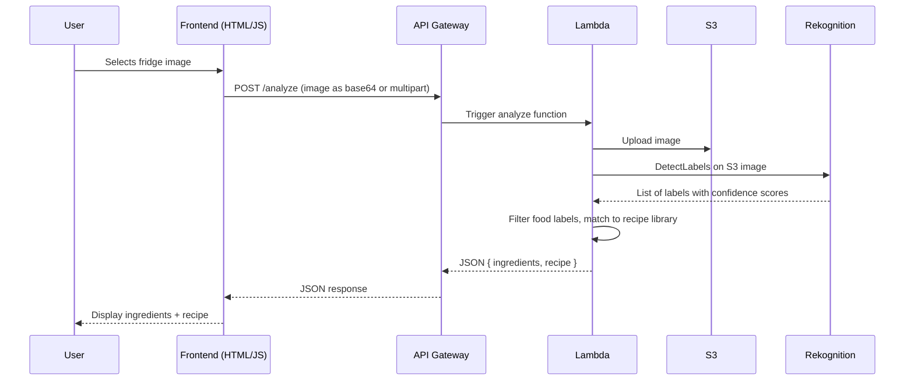

# Design Document: Fridge Recipe Generator

## Overview

A single-page web app where a user uploads a fridge photo, the image is analyzed by AWS Rekognition to detect food labels, and a matching recipe is returned from a pre-written library. The frontend is plain HTML/CSS/JS. The backend runs on AWS Lambda, exposed via API Gateway, and uses S3 for image storage and Rekognition for image analysis.

---

## Architecture



---

## Components and Interfaces

### Frontend (`frontend/`)

- `index.html` — single page with a file input, submit button, loading spinner, and results section
- `style.css` — minimal styling for layout and readability
- `script.js` — handles file selection, sends POST request to API Gateway, renders response

The frontend sends the image as a base64-encoded string in a JSON body:
```json
{
  "image": "<base64-encoded image data>",
  "filename": "fridge.jpg"
}
```

### API Gateway

- Single REST API with one resource: `POST /analyze`
- Configured with CORS enabled so the browser can call it
- Proxies the full request to the Lambda function

### Lambda Function (`backend/`)

- `app.py` — Lambda handler, orchestrates the full flow
- `aws_utils.py` — helper functions for S3 upload and Rekognition calls
- `recipes.py` — pre-written recipe library and matching logic

The Lambda handler flow:
1. Decode base64 image from request body
2. Upload image to S3 bucket
3. Call Rekognition `detect_labels` on the S3 object
4. Filter labels: food-related items with confidence >= 70%
5. Match filtered labels against recipe library
6. Return JSON response

Lambda response format:
```json
{
  "statusCode": 200,
  "body": {
    "ingredients": ["egg", "cheese", "tomato"],
    "recipe": {
      "name": "Cheesy Scrambled Eggs",
      "ingredients": ["2 eggs", "1/4 cup cheese", "1 tomato"],
      "instructions": ["Beat eggs...", "Add cheese...", "Serve with tomato"]
    }
  }
}
```

### S3 Bucket

- Stores uploaded fridge images temporarily
- Images are stored with a UUID-based key to avoid collisions
- Bucket is private; Lambda accesses it via IAM role

### Rekognition

- Uses `detect_labels` API
- Returns labels like "Food", "Egg", "Cheese", "Vegetable", etc.
- Lambda filters for food-relevant labels above the confidence threshold

---

## Data Models

### Recipe (in `recipes.py`)

```python
{
  "name": str,               # Recipe display name
  "keywords": [str],         # Ingredient keywords to match against Rekognition labels
  "ingredients": [str],      # Human-readable ingredient list
  "instructions": [str]      # Step-by-step instructions
}
```

### API Request Body

```json
{
  "image": "string (base64)",
  "filename": "string"
}
```

### API Response Body

```json
{
  "ingredients": ["string"],
  "recipe": {
    "name": "string",
    "ingredients": ["string"],
    "instructions": ["string"]
  }
}
```

---

## Error Handling

| Scenario | Behavior |
|---|---|
| Invalid file type | Lambda returns 400 with message "Unsupported file type" |
| Image too large (>10MB) | Frontend rejects before upload with user message |
| No food labels detected | Lambda returns 200 with empty ingredients and a "no match" message |
| No recipe match found | Lambda returns the closest partial match or a fallback message |
| S3 upload failure | Lambda returns 500 with generic error message |
| Rekognition failure | Lambda returns 500 with generic error message |
| CORS issues | API Gateway configured with appropriate CORS headers |

All Lambda errors are caught and returned as structured JSON so the frontend always gets a predictable response shape.

---

## Testing Strategy

Since this is a hackathon project, testing is kept lightweight:

- Manual end-to-end test: upload a real fridge photo and verify ingredients + recipe appear
- Unit test the recipe matching logic in `recipes.py` with a known set of labels
- Test the Rekognition label filtering with mock label data
- Verify API Gateway returns correct CORS headers using browser dev tools

---

## AWS Setup Notes (for reference during implementation)

- Create an S3 bucket (e.g. `fridge-recipe-images`)
- Create a Lambda function with Python 3.11 runtime
- Attach an IAM role to Lambda with permissions: `s3:PutObject`, `rekognition:DetectLabels`
- Create an API Gateway REST API, add `POST /analyze` resource, enable Lambda proxy integration
- Enable CORS on the API Gateway resource
- Deploy the API and copy the invoke URL into the frontend `script.js`
